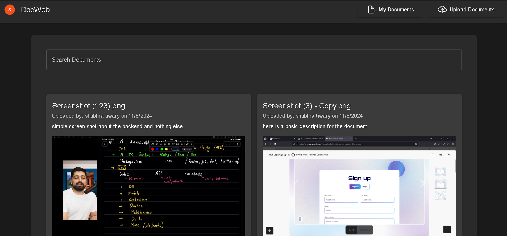

Document Management System
Overview

This project is a document management system that allows users to upload, describe, and manage documents with flexible visibility options. Users can choose to make documents public or private. The system includes features such as search functionality, pagination, and lazy loading to handle data efficiently. It is built with TypeScript and utilizes Firebase for document storage and metadata management. The user interface is styled with Material UI and supports drag-and-drop file uploads using React Drop-Zone.

⭐ Key Features

    🔐 Secure User Authentication: Managed by Clerk for robust and easy-to-use authentication.

    📁 File Uploads: Simple drag-and-drop file uploads using React Drop-Zone.

    ☁️ Cloud Storage: Securely stores all documents in Firebase Storage.

    📝 Metadata Management: Document details (like descriptions and visibility) are saved in Firestore.

    🔍 Search Functionality: Easily search for documents by name or description.

    🚀 Efficient Data Handling: Implements pagination and lazy loading for optimal performance.

    👀 Document Visibility: Set documents to public (visible to all) or private (visible only to the owner).

🛠️ Tech Stack

    Frontend: React, TypeScript, Vite, Material UI, React Drop-Zone

    Backend: Firebase (Firestore & Firebase Storage)

    Authentication: Clerk

    Language: TypeScript

Getting Started

Prerequisites:
  Node.js
  npm (or yarn)

Installation

    Clone the repository:

    bash

    git clone <repository-url>
    cd <repository-folder>

Install dependencies:

bash

     npm install
   # or
     yarn install

Set up Firebase:

    Create a Firebase project and configure Firestore and Firebase Storage.
    Obtain your Firebase configuration details (apiKey, authDomain, projectId, etc.).

Configure Firebase:

  Create a .env file in the root directory and add your Firebase configuration:

    .env

    VITE_FIREBASE_API_KEY=<your-api-key>
    VITE_FIREBASE_AUTH_DOMAIN=<your-auth-domain>
    VITE_FIREBASE_PROJECT_ID=<your-project-id>
    VITE_FIREBASE_STORAGE_BUCKET=<your-storage-bucket>
    VITE_FIREBASE_MESSAGING_SENDER_ID=<your-messaging-sender-id>
    VITE_FIREBASE_APP_ID=<your-app-id>

Start the development server:

bash

    npm run dev
    # or
    yarn dev

    Navigate to http://localhost:3000 to view the application.

Usage

    Authentication: Sign in or sign up using Clerk. Follow the authentication flow to gain access to the application.

    Upload Documents: Use the drag-and-drop area provided by React Drop-Zone to upload documents. Add a description and set the visibility (public or private). The document is stored in Firebase Storage, and its metadata is stored in Firestore.

    Search Documents: Utilize the search bar to find specific documents based on keywords.

    View Documents: Navigate through paginated results to view documents. Public documents are accessible to everyone, while private documents are only visible to the respective user.

Contributing

    Fork the repository.

    Create a feature branch:

    bash

    git checkout -b feature/your-feature

Commit your changes:

bash

    git commit -m 'Add some feature'

Push to the branch:

bash

    git push origin feature/your-feature

